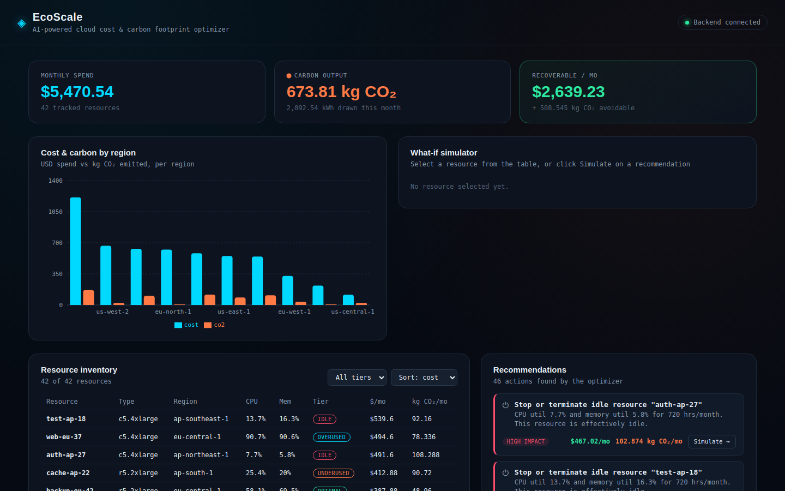
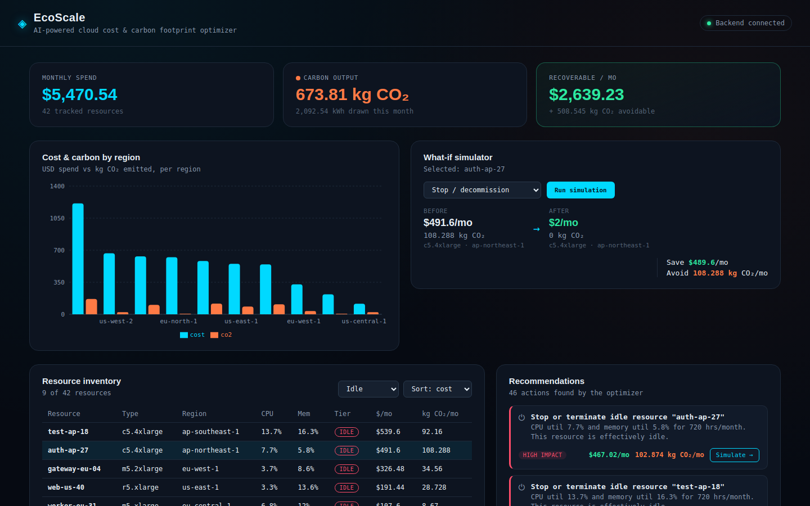

<div align="center">

# 🌿 EcoScale
### AI-Powered Cloud Cost & Carbon Footprint Optimizer

*Find the waste in your cloud fleet — in dollars **and** in kg CO₂.*


</div>

---

## 📊 See it in action

<div align="center">

<sub><b>Fleet-wide dashboard</b> — monthly spend, carbon output, and recoverable savings at a glance</sub>
</div>

<br>

<div align="center">

<sub><b>Resource inventory + recommendations</b> — filter by utilization tier, see ranked optimization actions</sub>
</div>

<br>

<div align="center">

<sub><b>What-if simulator</b> — one click to preview the before/after impact of an action</sub>
</div>

---

## The problem

Cloud teams can usually see cost *or* utilization — rarely both, and almost
never alongside carbon impact. Waste hides in the gap: an idle instance
that's been running 24/7 for months, an oversized box nobody downsized after
a launch, a workload sitting in a coal-heavy grid region when a cleaner one
was available the whole time.

**EcoScale ingests a cloud resource inventory and answers, per resource:**
is this wasteful, how do I know, and what does fixing it actually save —
in dollars and in CO₂?

## How it works

- **Cost model** — instance hourly rate × uptime, plus storage, computed per resource.
- **Carbon model** — estimated power draw (watts) × uptime → kWh → kg CO₂,
  using per-region grid carbon intensity.
- **KMeans clustering (scikit-learn)** groups resources into
  `idle / underused / optimal / overused` tiers based on their *actual*
  CPU + memory utilization pattern — learned from the fleet's own
  distribution, not arbitrary fixed cutoffs.
- **Recommendation engine** runs rule-based checks on top of those tiers:
  decommission idle resources, rightsize underused ones, flag overloaded
  ones, migrate to greener regions, and suggest reserved-instance
  commitments for steady, well-fitted workloads — each with an estimated
  $ and kg CO₂ savings.
- **What-if simulator** — pick any resource and an action (stop / downsize /
  move to greenest region), and see the before/after cost + carbon impact
  instantly.

## Stack

| Layer | Tech |
|---|---|
| Backend | Flask · Flask-CORS · scikit-learn · NumPy |
| Frontend | React · Vite · Recharts |
| Data | Mocked cloud inventory (42 resources), structured to match real billing/usage APIs |

## Project structure
```
ecoscale/
├── assets/screenshots/         # README images
├── backend/
│   ├── app.py                  # Flask API (routes)
│   ├── services/
│   │   ├── calculators.py      # cost + carbon math
│   │   └── optimizer.py        # KMeans tiering + recommendation engine
│   ├── data/
│   │   ├── resources.json      # mock cloud inventory (42 resources)
│   │   ├── instance_pricing.json
│   │   └── carbon_intensity.json
│   └── requirements.txt
└── frontend/
    ├── src/
    │   ├── App.jsx
    │   ├── api.js
    │   ├── components/
    │   └── styles/
    ├── index.html
    ├── package.json
    └── vite.config.js
```

## Running it locally

### 1. Backend
```bash
cd backend
python -m pip install -r requirements.txt
python app.py
```
Runs on **http://127.0.0.1:5000**. Test it with `curl http://127.0.0.1:5000/api/health`.

> On Windows, use `python`, not `python3`. If `pip install` fails on newer
> Debian/Ubuntu, add `--break-system-packages`.

### 2. Frontend
```bash
cd frontend
npm install
npm run dev
```
Runs on **http://127.0.0.1:5173**. Vite proxies `/api/*` to the Flask backend
(see `vite.config.js`) — just open the browser to that URL, no extra CORS
setup needed.

## API reference

| Method | Route | Description |
|---|---|---|
| GET | `/api/health` | Liveness check |
| GET | `/api/resources` | All resources, enriched with cost/CO₂/tier. Filters: `?region=`, `?tier=` |
| GET | `/api/regions` | Carbon intensity table by region |
| GET | `/api/dashboard` | Fleet-wide totals, by-region and by-tier breakdowns |
| GET | `/api/recommendations` | Optimization actions. Filter: `?severity=high\|medium\|low` |
| POST | `/api/simulate` | Body: `{"resource_id": "res-001", "action": "stop\|downsize\|move_to_greenest"}` → before/after impact |

## Swapping in real cloud data
Replace `backend/data/resources.json` with resources pulled from the AWS Cost
Explorer API / CloudWatch (for utilization) or Azure Cost Management API,
keeping the same field names (`instance_type`, `region`, `cpu_util_pct`,
`mem_util_pct`, `uptime_hrs_month`, `storage_gb`). Everything downstream —
cost calc, carbon calc, clustering, recommendations — works unchanged as
long as the shape matches.

## Notes
- Carbon intensity figures per region are illustrative approximations of
  public grid-intensity data, not live figures — swap in a live API
  (e.g. Electricity Maps) for production use.
- The KMeans model re-fits on every `/api/dashboard` and `/api/resources` call
  since the dataset is small (42 rows); for a larger real fleet you'd cache
  the fitted model and only re-run clustering periodically.

---

<div align="center">
<sub>Built with Flask, scikit-learn, and React · mock fleet data for demo purposes</sub>
</div>
